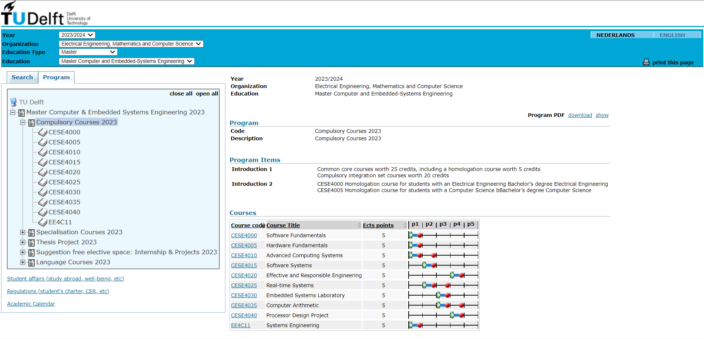
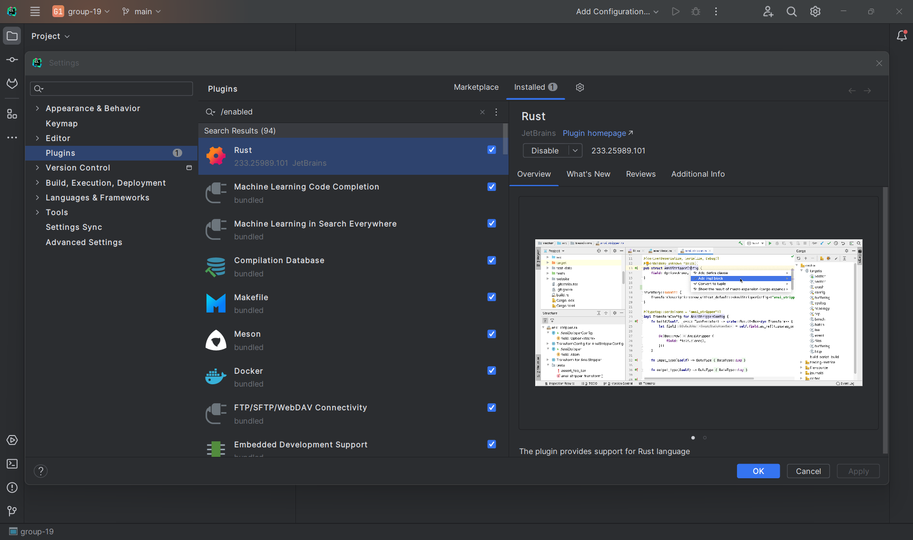

# TU Delft - EEMCS - CESE Guide

# Your Info Guide to EEMCS in TU Delft

Entering the Faculty of Electrical Engineering, Mathematics, and Computer Science (EEMCS) at TU Delft can be thrilling and demanding. To excel in this rigorous environment, follow these key tips:

### **Curriculum in EEMCS - CESE**

One of the most informative website is the [course browser search](https://www.studiegids.tudelft.nl/a101_displayProgram.do?program_tree_id=30874). By following the search parameters, you will know the compulsory courses that you have to take in EEMCS - Computer and Embedded Systems Engineering Masters. Please note that if your Bachelors Specialization was in Electrical Engineering, you are required to take Software Fundamentals and vice versa, Computer Science undergraduates would need to take Hardware Fundamentals in Semester 1.

### [Alternate View of Programme Courses](https://www.tudelft.nl/en/education/programmes/masters/msc-computer-embedded-systems-engineering/programme-in-detail)

## First Year (60 EC)

| Q1                                    | Q2                     | Q3                        | Q4                                       |
|---------------------------------------|------------------------|---------------------------|------------------------------------------|
| Adv. Computing Systems 5 EC           | Real Time Systems 5 EC | Embedded Systems Lab 5 EC | Effective & Responsible Engineering 5 EC |
| Systems Engineering 5 EC              | Software Systems 5 EC  | Computer Arithmetic 5 EC  | Processor Design Project 5 EC            |
| Software / Hardware Fundamentals 5 EC | Specialization 5 EC    | Specialization 5 EC       | Specialization 5 EC                      |

## Second Year (60 EC)

| Q1                                   | Q2                   | Q3 | Q4 |
|--------------------------------------|----------------------|----|----|
| Joint Interdisciplinary Project or   | Thesis Project 45 EC |    |    |
| Internship or Elective Courses 15 EC |                      |    |    |

Then you go to [Brightspace](https://login.tudelft.nl/sso/module.php/core/loginuserpass.php?AuthState=_dacbefd3bdaab0b27019e5098c7fbf37a6bd4d671d%3Ahttps%3A%2F%2Flogin.tudelft.nl%2Fsso%2Fsaml2%2Fidp%2FSSOService.php%3Fspentityid%3Dhttps%253A%252F%252Fengine.surfconext.nl%252Fauthentication%252Fsp%252Fmetadata%26cookieTime%3D1724878421https://login.tudelft.nl/sso/module.php/core/loginuserpass.php?AuthState=_dacbefd3bdaab0b27019e5098c7fbf37a6bd4d671d%3Ahttps%3A%2F%2Flogin.tudelft.nl%2Fsso%2Fsaml2%2Fidp%2FSSOService.php%3Fspentityid%3Dhttps%253A%252F%252Fengine.surfconext.nl%252Fauthentication%252Fsp%252Fmetadata%26cookieTime%3D1724878421) to enrol into the courses. Attend the lectures and finish all the assignments, quizzes, tests and exams to attain the necessary credits. 60 Credits are required for Year 1 and another 60 Credits for Year 2.

TU Delft students need to fill up the [Individual Exam Programme (IEP)](https://mystudyplanning.tudelft.nl/faculty/eemcs) along the course of their studies. This is the medium to report your desired track and obtain approval from

1. Masters Coordinator
2. Thesis Advisor
3. Board of Examiners

## Essential - Operating System

In the CESE Masters Programme, you will be working on projects that require Linux. [The teaching team strongly recommend using it.](https://cese.pages.ewi.tudelft.nl/software-fundamentals/linux.html) Based on experience, it is best to NOT deviate from that recommendation.

A stable version Ubuntu 22.04 has been used for many projects and thus been recommended for basic beginners to use. Ubuntu 22.04 ISO file can be downloaded [here](https://ubuntu.com/download/desktop).

To install it, follow this [tutorial by Ubuntu](https://ubuntu.com/tutorials/install-ubuntu-desktop#1-overview). This method uses a 12GB or above thumb-drive which renders it useless as a portable conventional storage media device. Do not delete the Ubuntu 22.04 USB stick as you or your friends will consistently need to reinstall Linux if IRREVERSIBLE mistakes causes failure in your project to run.

## Essential - Software

In the CESE Masters Programme, you will be programming in RUST. For starters, a common IDE used by many is VSCode. Let me share with you a competitive IDE called CLion.

### 1A - CLion Integrated Development Environment (IDE)

[https://www.jetbrains.com/help/clion/installation-guide.html#toolbox](https://www.jetbrains.com/help/clion/installation-guide.html#toolbox)

For Electrical Engineers, the [JetBrains Toolbox App](https://www.jetbrains.com/toolbox/app/) is the recommended tool to install JetBrains products.

However, if you are comfortable with installing it via the command line terminal, feel free to install using the Standalone Installation method.

To enable CLion, you first need to [register a free student account](https://account.jetbrains.com/login) with your student email. With your new student account, you can login to activate your JetBrains account on CLion.

Install the Rust Plugin. Access the Plugin Window via the Settings Gear icon on the top-right of CLion IDE Window.

### 2 - LaTeX

Most (if not all) projects require a report to be written to consolidate all the work done. Although small assignments only require 1-2 pages in the report, most (if not all) projects usually require 4 - 20 pages in the report. In fact, your final year thesis may even reach 100 or more pages. As such, students use Overleaf, an online LaTeX editor that allows for real-time collaboration and online compiling of LaTeX documents.

Similar to CLion, you can access Overleaf free by [login in with SSO](https://www.overleaf.com/login) using your student account.

LaTeX uses a typesetting system. That means you need to study a markup language to define the structure and appearance of the document unlike conventional Microsoft Word or Google Docs.

To overcome a steep learning curve of a complex tool, start off with [Overleaf Templates](https://www.overleaf.com/latex/templates). Find it hard to write equations in LaTeX, search for [LaTeX Equation Editors](https://latex.codecogs.com/eqneditor/editor.php). If you see an error, please be pro-active to resolve them. Or else, the standalone errors may eventually accumulate to even cause failure to compile your report.

This [tutorial online made in 2024 by Xiong Ying](https://latex-tutorial.com/tutorials/) is very clean and easy to read.

### 3 - GitLab

All code uploads are done on [GitLab](https://gitlab.ewi.tudelft.nl/users/sign_in).

To allow CLion IDE to access GitLab, click on your profile icon → Preferences → SSH Keys.

Follow this [tutorial to create SSH Key on Command Prompt](https://docs.gitlab.com/ee/user/ssh.html#ed25519-ssh-keys). E.g. ssh-keygen -t ed25519

Create filename. Access file [XXX.pub](http://XXX.pub) in the .ssh folder and copy-paste it into the new key on SSH Keys in GitLab by following another [tutorial here](https://www.tutorialspoint.com/gitlab/gitlab_ssh_key_setup.htm).

To understand Git for coding, here are four websites that provide visual explanations.

- learngitbranching.js.org
- ohmygit.org
- marklodato.github.io
- onlywei.github.io

### 4 - Messaging Apps

In CESE, Microsoft Teams (Used in Systems Engineering), Discord (Stopped since 2025), and WhatsApp (Only Amongst Students) are used.

### 5 - OBS

When video presentations are required for projects, OBS can be used to record video presentations with screen resolution of 1920 x 1080 px (Depending on Laptop Brand and Model)

Captions can be added to OBS using Maestra: [https://maestra.ai/tools/web-captioner](https://maestra.ai/tools/web-captioner)

### Free Guides

[sci-hub.se/](https://sci-hub.se/)

[From data to Viz | Find the graphic you need](https://www.data-to-viz.com/#violin)

[Tutorial – Typst Documentation](https://typst.app/docs/tutorial/)

### Career Guide

You can keep a look-out for career related events i.e. EEMCS Recruitment Day, Delft Career Days. Not all are free. So, please check for the programme and register if interested.

Another portal you can use is [TU Delft Your Career Portal](https://tudelft.jobteaser.com/en/job-offers)

### Conclusion

Quarter 1 is hectic and packed. The learning curve may be extremely daunting, but it may be less so with careful preparation and adjustment. By following the steps outlined in this blog post and taking advantage of the resources available to you, you can make a smooth transition to student life in the CESE Programme. Good luck on your journey!