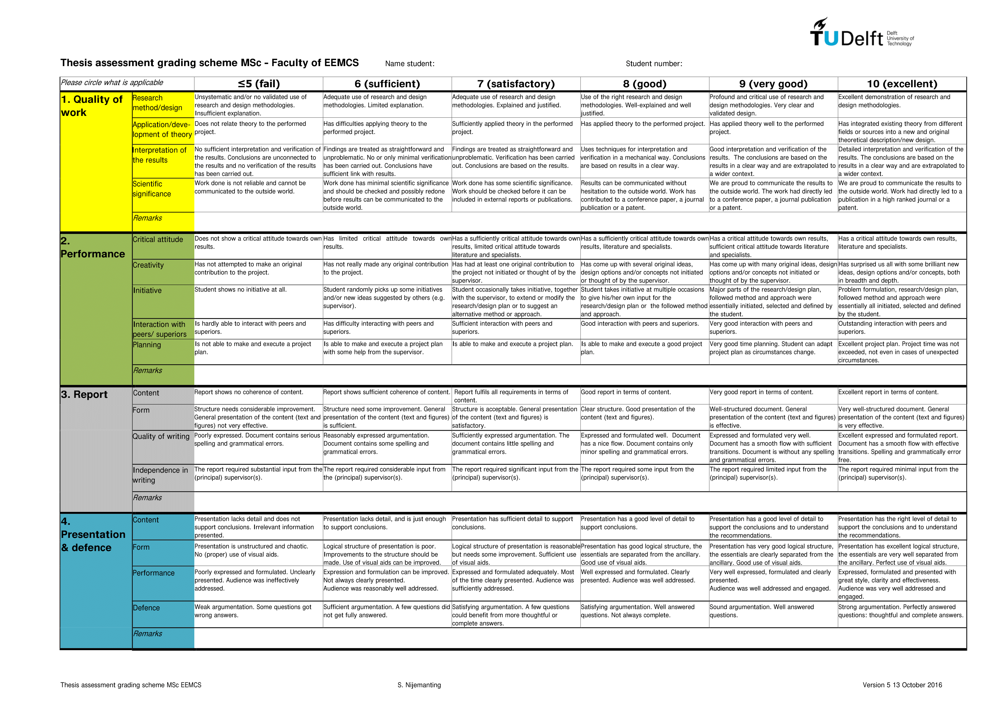

# Your Unofficial Guide to Thesis Writing

Writing a thesis at TU Delft is the culmination of your academic journey and represents your ability to conduct independent research. This unofficial guide will help you navigate the thesis process from initial planning to final submission, ensuring you meet all requirements and produce high-quality work.

## 📋 Table of Contents

1. [Understanding the Thesis Process](#understanding-the-thesis-process)
   - [Thesis Overview](#thesis-overview)
   - [Thesis Types](#thesis-types)

2. [Pre-Thesis Preparation](#pre-thesis-preparation)
   - [Handle Thesis Admin via MaRe System](#handle-thesis-admin-via-mare-system)
   - [Timeline Planning](#timeline-planning)
   - [Scope of Each Presentation](#scope-of-each-presentation)
   - [Finding a Supervisor](#finding-a-supervisor)
   - [Required Documentation](#required-documentation)

3. [Recommended Digital Repository Structure](#recommended-digital-repository-structure)

4. [In-Person Meetings with Supervisor](#in-person-meetings-with-supervisor)

5. [Thesis Structure and Requirements](#thesis-structure-and-requirements)
   - [Standard Thesis Structure](#standard-thesis-structure)
   - [Page Requirements](#page-requirements)
   - [Formatting Requirements](#formatting-requirements)

6. [Research Methodology](#research-methodology)
   - [Research Design](#research-design)
   - [Data Collection Methods](#data-collection-methods)
   - [Data Analysis](#data-analysis)

7. [Writing Process](#writing-process)
   - [Writing Timeline](#writing-timeline)
   - [Writing Tips](#writing-tips)
   - [Academic Writing Style](#academic-writing-style)

8. [English Writing Standards](#english-writing-standards)
   - [General Principles](#general-principles)
   - [Grammar and Style](#grammar-and-style)
   - [Punctuation and Formatting](#punctuation-and-formatting)

9. [Supervision and Feedback](#supervision-and-feedback)
   - [Working with Your Supervisor](#working-with-your-supervisor)
   - [Email Etiquette](#email-etiquette)
   - [Peer Review and Support](#peer-review-and-support)

10. [Quality Assurance](#quality-assurance)
    - [Official TU Delft MSc Grading Rubrics](#official-tu-delft-msc-grading-rubrics)

11. [Submission and Defense](#submission-and-defense)
    - [Pre-Submission Checklist for Report](#pre-submission-checklist-for-report)
    - [Pre-Submission Checklist for Code](#pre-submission-checklist-for-code)
    - [Before Reviewing Documents](#before-reviewing-documents)
    - [Submission Process](#submission-process)
    - [Thesis Defense](#thesis-defense)

12. [Resources and Support](#resources-and-support)
    - [University Resources](#university-resources)
    - [Software and Tools](#software-and-tools)
    - [Online Resources](#online-resources)

13. [Success Tips](#success-tips)
    - [When to Seek Help](#when-to-seek-help)

14. [Conclusion](#conclusion)

## Understanding the Thesis Process

### **Thesis Overview**

A thesis at TU Delft typically represents 45 EC (European Credits) and is conducted over 6-9 months. It demonstrates your ability to:
- Conduct independent research
- Apply theoretical knowledge to practical problems
- Analyze and interpret results
- Communicate findings effectively
- Contribute to your field of study

### **Thesis Types**

| Type               | Duration   | Credits  | Focus                             |
|--------------------|------------|----------|-----------------------------------|
| Research Thesis    | 6-9 months | 45 EC    | Original research contribution    |
| Industry Thesis    | 6-9 months | 45 EC    | Applied research in industry      |

## Pre-Thesis Preparation

### Handle Thesis Admin via MaRe System

[MaRe](https://mare.ewi.tudelft.nl/login) is the official Master Thesis Registration system for all EEMCS MSc programmes at TU Delft. All thesis committee and final examination forms must be submitted via MaRe.

- **Register your thesis project** in MaRe as soon as you start your graduation process.
- MaRe tracks your project progress, sends automated reminders for important deliverables, and simplifies administrative procedures (such as submitting proposals and committee forms).
- **Students** enter project details and submit required forms; 
- **supervisors and support staff** monitor progress and approve milestones.

For more information and official instructions, see the [Master Formulieren page](https://www.tudelft.nl/studenten/ewi-studentenportal/onderwijs/formulieren/master-formulieren).

### **Timeline Planning**

**6-9 Months Before Start:**
- Identify potential supervisors and research areas
- Attend thesis information sessions
- Review faculty-specific requirements
- Prepare your CV and motivation letter

**3-4 Months Before Start:**
- Contact potential supervisors
- Discuss research proposals
- Secure funding if required
- Complete necessary paperwork

**1-2 Months Before Start:**
- Finalize supervisor agreement
- Define research scope and objectives
- Set up project timeline
- Prepare workspace and tools

The following timeline is recommended for a 45 EC MSc thesis at TU Delft EEMCS (e.g., Computer Engineering, Telecom, Embedded Systems, Microelectronics) from Start of Thesis:

- **Month 0:** Update your Individual Exam Programme (IEP) and apply for the Thesis Entrance Permit.
- **Month 1:** Enroll at SPS using the "SPS Member" form with the secretary, define your thesis topic with your advisor, start your literature search, and give a 5-minute starting presentation in the MSc seminar.
- **Month 3:** Submit the thesis committee form to the exam committee (at least 3 months before your planned graduation date).
- **Month 4:** Present a 15-minute midterm presentation in the MSc seminar.
- **Month 7:** Obtain permission ("green light") to defend your thesis, set your graduation date, and submit the final examination request form (at least 6 weeks before your defense).
- **Month 8-9:** Defend your thesis and receive your MSc diploma!

**Tips:**
- You are the project leader: take responsibility for progress, reporting, and regular meetings with your advisors and other experts.
- Attend MSc midterm seminars and defenses to learn from your peers and improve your own presentation skills.
- Use the lab's Latex template for your thesis report.
- Use the official EEMCS graduation policy and timeline to avoid administrative delays.

For more details, forms, and templates, see the [SPS MSc thesis guidelines](https://sps.ewi.tudelft.nl/Education/mscguidelines.php) and [EEMCS Master Formulieren page](https://www.tudelft.nl/studenten/ewi-studentenportal/onderwijs/formulieren/master-formulieren).

### **Scope of Each Presentation**

- **First-pitch presentation** (Strictly 5 minutes, in weeks 2–4): Present your thesis topic and objectives to the CAS group and any external supervisors.
- **Mid-term presentation** (Strictly 10 minutes, in weeks 17–18): Show the first results of your work and receive feedback.
- **Final presentation and defense** (Strictly 30 minutes, in weeks 30–32): Present your completed thesis work and defend your results.

### **Finding a Supervisor**

1. **Research Faculty Members**
   - Browse faculty websites and publications
   - Attend research presentations and seminars
   - Review recent thesis topics in your field

2. **Contact Potential Supervisors**
   - Send professional emails with your CV
   - Include specific research interests
   - Mention relevant coursework and experience
   - Request meetings to discuss possibilities

3. **Prepare for Meetings**
   - Research the supervisor's work
   - Prepare questions about their research
   - Bring your academic transcript
   - Discuss potential thesis topics

### **Required Documentation**

- **Individual Exam Programme (IEP)** - Must be approved before starting
- **Thesis Agreement** - Signed by supervisor and student
- **Ethics Approval** - If required for your research
- **Data Management Plan** - For handling research data
- **Risk Assessment** - For laboratory or field work

## Recommended Digital Repository Structure

To organize your thesis work efficiently, create a OneDrive folder using your TU Delft account, named `Firstname Lastname`. Share the link with your supervisor with full access. Inside, create the following subfolders:

1. **01 administrative**: All thesis-related administration forms. Include a timeline of your thesis (see timeline planning section).
2. **02 literature**: Publications for reference/reading, named in the format (authorYY or authorYY_title).
3. **03 reports**: Your periodic reports, and supervisor's comments/feedback.
4. **04 presentations**: All presentations, posters, and outreach documents.
5. **05 notes**: Meeting notes and records of agreements with your supervisor.
6. **06 code**: Programming code related to your thesis.
7. **07 project**: (If necessary) Documents related to a specific project.

This structure will help you and your supervisor keep all thesis materials organized and accessible throughout your project.

## In-Person Meetings with Supervisor

1. **Periodic meetings** of 30 minutes will be scheduled with you during your thesis period.
2. These meetings are not compulsory; if not necessary, they should be cancelled at least a day in advance.
3. Each meeting should not exceed 25 minutes, but will have a 30-minute slot.
4. **Tentative agenda:**
    - **First 5 minutes:**
        - Discuss thesis problem, goals, timeline, etc.
        - Review previous action points: Have they been addressed? What is your current challenge?
    - **Next 15 minutes:** Technical discussion
    - **Next 5 minutes:** List your action points prior to the next meeting
    - **Final 5 minutes:** Any Other Business (AOB)
5. Extended meetings can be set up for in-depth technical discussions as needed.

## Thesis Structure and Requirements

### **Standard Thesis Structure**

```
1. Title Page
2. Abstract (English and Dutch)
3. Table of Contents
4. List of Figures/Tables
5. Introduction
6. Literature Review
7. Methodology
8. Results
9. Discussion
10. Conclusion
11. Recommendations
12. References
13. Appendices
```

### **Page Requirements**

| Section            | Typical Length  | Notes                                |
|--------------------|-----------------|--------------------------------------|
| Abstract           | 250-300 words   | In English                           |
| Introduction       | 5-8 pages       | Problem statement and objectives     |
| Literature Review  | 10-15 pages     | Critical analysis of existing work   |
| Methodology        | 8-12 pages      | Detailed research approach           |
| Results            | 15-25 pages     | Data presentation and analysis       |
| Discussion         | 10-15 pages     | Interpretation and implications      |
| Conclusion         | 3-5 pages       | Summary and future work              |
| **Total** | **60-80 pages**          | Excluding appendices                 |

### **Formatting Requirements**

- **Font**: Times New Roman or Arial, 12pt
- **Line Spacing**: 1.5 or double-spaced
- **Margins**: 2.5 cm on all sides
- **Page Numbers**: Bottom center
- **Language**: English (unless otherwise specified)
- **File Format**: PDF for submission
- **Template**: Use your lab's Latex template for your thesis report.

## Research Methodology

### **Research Design**

**Quantitative Research:**
- Surveys and questionnaires
- Experimental studies
- Statistical analysis
- Data modeling

**Qualitative Research:**
- Interviews and focus groups
- Case studies
- Content analysis
- Ethnographic studies

**Mixed Methods:**
- Combination of quantitative and qualitative
- Triangulation of data sources
- Comprehensive analysis

### **Data Collection Methods**

| Method             | Advantages                        | Disadvantages                        | Best For |
|--------------------|-----------------------------------|--------------------------------------|----------|
| Surveys            | Large sample size, standardized   | Low response rate, limited depth     | Quantitative studies |
| Interviews         | Rich data, flexibility            | Time-consuming, small sample         | Qualitative studies |
| Experiments        | Control, causality                | Artificial setting, ethical concerns | Scientific research |
| Case Studies       | Detailed analysis, real context   | Limited generalizability             | Applied research |
| Literature Review  | Comprehensive overview            | No new data collection               | Theoretical studies |

### **Data Analysis**

**Quantitative Analysis:**
- Statistical software (SPSS, R, Python)
- Descriptive and inferential statistics
- Regression analysis
- Hypothesis testing

**Qualitative Analysis:**
- Thematic analysis
- Content analysis
- Grounded theory
- Discourse analysis

## Writing Process

### **Writing Timeline**

**Month 1-2: Foundation**
- Literature review
- Methodology development
- Data collection planning

**Month 3-4: Data Collection**
- Implement research methods
- Collect and organize data
- Begin preliminary analysis

**Month 5-6: Analysis**
- Complete data analysis
- Interpret results
- Identify key findings

**Month 7-8: Writing**
- Write results and discussion
- Complete all chapters
- First draft review

**Month 9: Finalization**
- Incorporate feedback
- Final editing and proofreading
- Submission preparation

### **Writing Tips**

**Getting Started:**
- Write daily, even if just notes
- Start with the methodology section
- Use bullet points and outlines
- Don't aim for perfection in first draft

**Improving Quality:**
- Use clear, concise language
- Avoid jargon and acronyms
- Provide concrete examples
- Support claims with evidence

**Common Mistakes to Avoid:**
- Procrastination and last-minute writing
- Insufficient literature review
- Weak methodology justification
- Poor data presentation
- Inadequate discussion of limitations

### **Academic Writing Style**

**Abbreviations:**
- Introduce abbreviations on first use
- Preferably in abstract, introduction, and conclusion
- Use consistently: "a SOC" or "an SOC" (but be consistent)
- Consider using LaTeX acronym package for long documents

**Do:**
- Use active voice when appropriate
- Write in third person for formal sections
- Use present tense for established facts
- Use past tense for your research activities
- Be precise and specific
- "at an abstraction level" not "on a level"
- "to" instead of "in order to"
- Proper distinction between "fewer" (number) and "less" (quantity)

**Don't:**
- Use informal language or contractions like colloquial expressions (it's, can't, though, till)
- Phrases like "it is obvious," "obviously," "as is well-known"
- Include personal opinions without evidence
- Ellipses ("...") especially with etc. or e.g.
- Dashes for parenthetical sentences (use commas)
- Use vague or ambiguous terms
- Overuse passive voice
- Include unnecessary details

### **Citations and References**

**Self-Contained Documents:**
- Distribute sources as single self-contained directory
- No system-dependent tools required
- Must compile without errors
- Include makefile with `clean` and `all` targets
- Use single LaTeX file rather than multiple `\input` files

**Bibliography Management:**
- Fix all bibliography and bibtex errors
- Force correct capitalization: `{SOC}` or `{Put a {SOC} in it}`
- Use common bibtex file across papers
- Use good naming scheme: `AuthorYearConference`
- Sort bibtex entries by key

**Citation Formatting:**
- Use unbreakable space before citations: `silly~\cite{key}`
- Citations should never be detached from preceding text
- Proper spacing around punctuation marks

**Text Formatting:**
- Use bold face sparingly
- Use italics with moderation
- Never underline
- Use `\emph{text}` for italics in text
- Use `\textit{}` for text in mathmode

**Custom Commands:**
- Use `\newcommand{}` for recurring expressions
- Example: `\newcommand{\aethereal}{{\AE{}thereal}}`
- Makes notation changes easier

## English Writing Standards

### **General Principles**

**Language Consistency:**
- Use either British or American English consistently
- Write clear and unambiguous English
- Use proper articles (a, an, the) before nouns

**Logical Connectives:**
Understand the difference between:
- **Because** (B ⇒ A): "A because B"
- **Thus** (A ⇒ B): "A thus B"
- **Although/Though**: Concession
- **However**: Contrast
- **Moreover**: Additional information

### **Grammar and Style**

**Verb Forms:**
- Use "to verb" not "for verb-ing"
- Example: "to explain this point" not "for explaining this point"

**Terminology:**
- Define terminology consistently
- Use same words for same concepts
- Don't use same word for different things

**Singular/Plural Agreement:**
- "Each" is singular
- "Both," "all" are plural
- "Any" can be singular or plural depending on context

**Active Voice:**
- Write active sentences
- Avoid: "the controller is orchestrating the SOC"
- Prefer: "the controller orchestrates the SOC"

### Punctuation and Formatting

**Quotes and Punctuation:**
- Full stops, commas, semicolons go inside quotes
- Use "these quotes" for literal citations
- Avoid single quotes unless necessary

**That vs. Which:**
- **That**: Essential information (no comma)
- **Which**: Non-essential information (with comma)

**Oxford Comma:**
- Prefer: "A, B, and C"
- Use to indicate subtle subgrouping

**Hyphenation:**
- Use hyphens correctly for compound adjectives
- Examples:
  - "Power management" (power is adjective of management)
  - "Power-management strategy" (power management is adjective)
  - "Power management-strategy" (power is adjective of management strategy)

### **Figures and Graphics**

**Figure Requirements:**
- Every figure must be referred to in text
- Explain why figure is included and what it shows
- Use unbreakable spaces: `Figure~\ref{fig:tradeoff}`
- Use meaningful labels: `\label{fig:tradeoff}`, `\label{sec:introduction}`

**Figure Captions:**
- Figure captions below figure
- Table captions above table
- Place `\label` after `\caption`

**Graphics Quality:**
- All graphics should be scalable and high resolution
- Use consistent style across presentations
- Embed fonts in PDFs

### **Units and References**

**Units:**
- Precede units with space: `10~nm`
- Units are not italic

**Page References:**
- Capitalize "Figure," "Section," "Table" when using numbers
- Don't refer to "the figure below/above" - use numbers
- Page references are exception (not capitalized)

### **Version Control and File Naming**

**Version Numbering:**
- Use version numbers in all documents: `filename_v1.suffix` or `YYYY-MM-DD-filename.suffix`
- Ensure filenames sort correctly (older documents first)
- Choose meaningful names for others

**European Project Naming Convention:**
```
<date>_<document title>_<version>_<partner>.<extension>
```

**Examples:**
- `2009-03-04_INDEXYS_project-handbook_v1-0.pdf`
- `2009-04-27_INDEXYS_deliverable-1-3_v0-3.doc`
- `2009-05-12_INDEXYS_deliverable-1-3_v0-3_TTT.doc`

**Version Management:**
- When returning annotated documents, use: `filename_v1_your-initials.suffix`
- Do not increase version number for review comments
- Ensure comments from previous versions are addressed
- Check entire document for similar mistakes when errors are found

## Supervision and Feedback

### **Working with Your Supervisor**

**Regular Meetings:**
- Schedule weekly or bi-weekly meetings
- Prepare agenda and questions
- Bring progress updates
- Take notes during meetings

**Communication:**
- Be proactive in communication
- Respond to emails promptly
- Share drafts in advance
- Ask for specific feedback

**Managing Feedback:**
- Accept constructive criticism
- Ask for clarification when needed
- Implement suggested changes
- Keep track of all feedback

### **Email Etiquette**

**Subject Lines:**
- Use subjects that reflect purpose and content
- Be specific and descriptive

**Formality Levels:**
- **Friends/Direct Colleagues**: No salutation, "hi," "howdy," "hey" acceptable
- **Beyond Direct Colleagues**: Use "Hello FirstName," "Dear FirstName," or "Dear Mr./Mrs./Prof. SurName"
- **Unknown Gender**: Use "Dear Sir/Madam"
- **When in Doubt**: Err on the formal side

**Attachments:**
- Include documents in emails rather than URLs
- Check that desired attachments are included
- Disk space is cheap, accessibility is important

### **Peer Review and Support**

- **Study Groups**: Form thesis writing groups
- **Writing Centers**: Use university writing support
- **Peer Review**: Exchange drafts with classmates
- **Online Forums**: Join academic writing communities

## Quality Assurance

### **Official TU Delft MSc Grading Rubrics**

For the most current and detailed assessment criteria, refer to the official [TU Delft MSc Grading Rubrics 2016](TUDelft-ThesisGuide-MScGradingRubrics2016.pdf) document. This official document provides comprehensive evaluation standards used by thesis committees.



## Submission and Defense

### **Pre-Submission Checklist for Report**

- [ ] All chapters completed and reviewed
- [ ] Spell-check completed
- [ ] Page numbers included
- [ ] Table of contents for long documents
- [ ] Version number in filename
- [ ] All previous feedback addressed
- [ ] Abstract written
- [ ] References properly formatted
- [ ] Appendices included
- [ ] Plagiarism check completed
- [ ] Supervisor approval obtained
- [ ] Format requirements met
- [ ] Electronic and hard copies ready

### **Pre-Submission Checklist for Code**
- [ ] Compiles without warnings
- [ ] All assertions included
- [ ] Comprehensive testing completed
- [ ] Descriptive names used
- [ ] Makefile included
- [ ] Version controlled

### **Before Reviewing Documents**

- [ ] Apply three-level review process
- [ ] Check all items in review checklist
- [ ] Write professional, impersonal review
- [ ] Provide constructive suggestions
- [ ] Maintain consistent review standards

### **Submission Process**

1. **Final Review**: Supervisor reviews complete thesis
2. **Format Check**: Ensure all formatting requirements met
3. **Plagiarism Check**: Submit through university system
4. **Official Submission**: Submit to faculty office
5. **Committee Assignment**: Thesis committee formed
6. **Defense Scheduling**: Defense date and time set

### **Thesis Defense**

**Presentation Structure:**
- Introduction (2-3 minutes)
- Problem statement and objectives (3-4 minutes)
- Methodology (7-8 minutes)
- Results and analysis (9-11 minutes)
- Conclusions and recommendations (3-4 minutes)
- Questions and discussion (15-20 minutes)

## Resources and Support

### **University Resources**

- **Thesis Manual**: Faculty-specific guidelines
- **Writing Center**: Academic writing support
- **Library Services**: Research and citation help
- **IT Support**: Software and technical assistance
- **Student Counseling**: Mental health and stress management

### **Software and Tools**

**Writing and Formatting:**
- LaTeX (Overleaf) - Professional document formatting
- Zotero/Mendeley - Reference management
- Grammarly - Grammar and style checking

**Research and Analysis:**
- SPSS/R/Python - Statistical analysis
- NVivo - Qualitative data analysis
- MATLAB - Mathematical modeling
- Git - Version control for code

**Project Management:**
- Teams - Task organization
- Notion - Note-taking and organization
- Google Calendar - Timeline management

### **Online Resources**

- **TU Delft Repository**: Previous thesis examples
- **Google Scholar**: Academic literature search
- **ResearchGate**: Academic networking
- **arXiv**: Preprint papers
- **IEEE/ACM Digital Libraries**: Technical papers

## Success Tips

### **When to Seek Help**

- **Academic Support**: Writing centers, library services
- **Technical Support**: IT help, software training
- **Mental Health**: Student counseling, stress management
- **Supervision Issues**: Program coordinator, academic advisor
- **Personal Issues**: Student services, peer support groups

## Conclusion

Writing a thesis at TU Delft is a challenging but rewarding experience that demonstrates your academic capabilities and prepares you for future research or professional work. By following this guide, maintaining regular communication with your supervisor, and staying organized throughout the process, you can successfully complete your thesis and contribute valuable knowledge to your field.

Remember that every thesis journey is unique, and it's normal to face challenges along the way. Stay focused on your goals, seek support when needed, and take pride in your academic achievement. Good luck with your thesis!

---

*This guide provides general information about thesis writing at TU Delft. Always refer to your specific faculty guidelines and supervisor requirements for detailed information about your particular thesis requirements.* 