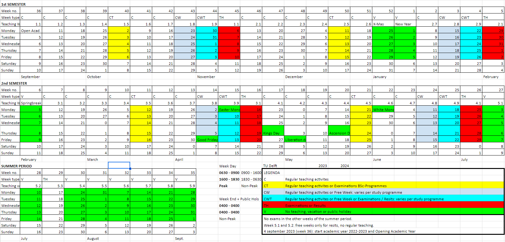

# TU Delft - Survival Guide

# Migrating to TU Delft as a Student

Migrating to a new country for studies can be a daunting experience, but it can also be one of the most enriching experiences of your life. If you are considering studying at TU Delft, one of the top technical universities in the world, this blog post will guide you through the process of migrating to the Netherlands as a student.

## Preparing for the Move

Before you embark on your journey to TU Delft, there are several things you should do to prepare. First, you should ensure that you have all the necessary documentation, including your passport, student visa, and acceptance letter from TU Delft. You should also research the cost of living in the Netherlands and plan your budget accordingly. Additionally, you may want to learn some basic Dutch phrases to help you navigate your new surroundings.

### **Cost of Living**

[https://www.numbeo.com/cost-of-living/](https://www.numbeo.com/cost-of-living/)

Recommended to bring a minimum of 1000€ for first month of living expenses (excluding Rent). Bring 2000€ just in case bank account is not set up within the first month due to delays.

Feel free to use Digital Bank Apps like Revolut or WISE with their MasterCard or VISA Options.

Please note that Albert Heijn (a popular supermarket) is an exception that uses Maestro Card (Get one from Dutch Banks) and do not accept MasterCard or VISA.

### [Sign Up for Introduction Program](https://www.tudelft.nl/en/education/practical-matters/introduction-period/msc-and-bridging-august)

Try not to skip it as seniors will guide you on Campus Discovery, Brightspace Pulse and Portal Navigation and Bike Purchase. You can follow the [TU Delft IP on Instagram](https://www.instagram.com/tudelftip/) to get a feel of Introduction Programme based on previous year’s programme

### Housing Portals

| Housing organization                    | Trust Pilot | Student acc. | Couple | Family | Shared |
|-----------------------------------------|-------------|--------------|--------|--------|--------|
| RoomPlaza                               | 4.4         | X            | X      | X      | X      |
| Bjornd Brokerage                        | NA          |              | X      | X      |        |
| Funda                                   | 1.9         | X            | X      | X      | X      |
| Pararius - Homeland Real Estate ^       | 4.7         | X            | X      | X      |        |
| Holland Homestay                        | NA          | X            | X      |        | X      |
| Rooms in Delft - Holidays / Rent Slam   | 0           | X            |        |        |        |
| Rooms.nl - Idealis vs DUWO/XIOR         | 3.3         | X            | X      | X      | X      |
| Kamernet.nl                             | 3.5         | X            |        |        | X      |
| Student Housing The Hague               | 4.3         | X            | X      |        | X      |
| The Social Hub - Holidays               | NA          | X            | X      |        |        |
| 4-Freedom Property Management           | NA          | X            | X      | X      | X      |
| Be Home                                 | NA          | X            | X      | X      |        |
| Direct Living                           | NA          | X            | X      | X      | X      |
| Homelets.nl                             | 2.9         | X            | X      | X      | X      |
| HometoGo - Not Private and Holidays     | 2.4         |              |        |        |        |
| Hostel Delft - Not Private and Holidays | NA          |              |        |        |        |
| Housing source                          | 2.3         | X            | X      | X      |        |
| HousingAnywhere                         | 3.7         | X            | X      | X      | X      |
| Huurwoningen.nl / Huurportaal.nl        | 4.4         | X            | X      | X      | X      |
| Kamer.nl                                | 0           | X            | X      | X      |        |
| Stadium                                 |             |              | X      | X      |        |
| MaliepaardBrokers                       | NA          |              | X      | X      |        |
| MB275                                   | NA          | X            | X      |        |        |
| Old Delft Brokerage                     | NA          |              | X      | X      |        |
| OurDomain Rotterdam Blaak - Holidays    | NA          | X            | X      |        |        |
| Villaci                                 |             |              | X      | X      |        |
| Plaza Resident Services - Not Private   | 0           | X            |        |        |        |
| Rock - Fixed Group                      | NA          | X            | X      | X      | X      |
| Sealed Management                       | NA          | X            |        |        |        |
| Son's Real Estate                       | NA          | X            |        |        | X      |
| vestia                                  | 1.9         | X            | X      | X      |        |

### Apps

| [My TU Delft](https://apps.apple.com/nl/app/my-tu-delft-student/id1395269408) | [Brightspace Pulse](https://apps.apple.com/nl/app/brightspace-pulse/id1001688546) | [Uni-Life](https://apps.apple.com/nl/app/uni-life/id1320860920) (Not as useful as Clubs) | [OVPay](https://apps.apple.com/nl/app/ovpay/id1542164084) (Not as useful as Kiosk) | [NS](https://apps.apple.com/nl/app/ns/id370362301) (Primary) | [9292](https://apps.apple.com/nl/app/9292-reisplanner-ov-e-ticket/id556557690) (Secondary) | [Google Translate](https://apps.apple.com/nl/app/google-translate/id414706506) |
|-------------------------------------------------------------------------------|-----------------------------------------------------------------------------------|------------------------------------------------------------------------------------------|------------------------------------------------------------------------------------|--------------------------------------------------------------|--------------------------------------------------------------------------------------------|--------------------------------------------------------------------------------|

### Weather in Delft

| Month                                                                                                   | Temperature | Rainy Days | Dry Days | Snowy Days | Rainfall (mm) | Weather |
|---------------------------------------------------------------------------------------------------------|-------------|------------|----------|------------|---------------|---------|
| [January](https://www.weather25.com/europe/netherlands/zuid-holland/delft?page=month&month=January)     | 6° / 4°     | 10         | 18       | 4          | 107           | Awful   |
| [February](https://www.weather25.com/europe/netherlands/zuid-holland/delft?page=month&month=February)   | 6° / 3°     | 8          | 16       | 4          | 78            | Awful   |
| [March](https://www.weather25.com/europe/netherlands/zuid-holland/delft?page=month&month=March)         | 9° / 5°     | 6          | 24       | 1          | 67            | Ok      |
| [April](https://www.weather25.com/europe/netherlands/zuid-holland/delft?page=month&month=April)         | 13° / 7°    | 3          | 26       | 1          | 45            | Ok      |
| [May](https://www.weather25.com/europe/netherlands/zuid-holland/delft?page=month&month=May)             | 15° / 10°   | 5          | 26       | 0          | 79            | Good    |
| [June](https://www.weather25.com/europe/netherlands/zuid-holland/delft?page=month&month=June)           | 18° / 13°   | 5          | 25       | 0          | 90            | Good    |
| [July](https://www.weather25.com/europe/netherlands/zuid-holland/delft?page=month&month=July)           | 20° / 16°   | 7          | 24       | 0          | 116           | Ok      |
| [August](https://www.weather25.com/europe/netherlands/zuid-holland/delft?page=month&month=August)       | 21° / 16°   | 7          | 24       | 0          | 138           | Ok      |
| [September](https://www.weather25.com/europe/netherlands/zuid-holland/delft?page=month&month=September) | 19° / 14°   | 6          | 24       | 0          | 109           | Good    |
| [October](https://www.weather25.com/europe/netherlands/zuid-holland/delft?page=month&month=October)     | 15° / 11°   | 8          | 23       | 0          | 124           | Ok      |
| [November](https://www.weather25.com/europe/netherlands/zuid-holland/delft?page=month&month=November)   | 11° / 8°    | 7          | 22       | 1          | 115           | Bad     |
| [December](https://www.weather25.com/europe/netherlands/zuid-holland/delft?page=month&month=December)   | 8° / 5°     | 10         | 18       | 3          | 118           | Awful   |

### Things to Bring to TU Delft

| S/N                                                                           | [Items to Bring](https://www.tudelft.nl/studenten/faculteiten/tbm-studentenportal/international-student/prepare-your-stay/checklist) | S/N | [Items to Bring](https://www.tudelft.nl/studenten/faculteiten/tbm-studentenportal/international-student/prepare-your-stay/checklist)                               |
|-------------------------------------------------------------------------------|--------------------------------------------------------------------------------------------------------------------------------------|-----|--------------------------------------------------------------------------------------------------------------------------------------------------------------------|
| 1                                                                             | Passport                                                                                                                             | 7   | Birth (Compulsory) + Marriage Cert. (Optional)                                                                                                                     |
| 2                                                                             | VISA from Embassy                                                                                                                    | 8   | [Driver's License / International Driving Permit 1 Year](https://idponline.aas.com.sg/pages/Application?spm=BlogArticle.InArticleHyperlinkWord&clickId=06a832f733) |
| 3                                                                             | High School & Uni Certs                                                                                                              | 9   | Handphone / Laptop / Chargers                                                                                                                                      |
| 4                                                                             | TU Delft Official Letter                                                                                                             | 10  | Clothes for Summer & Winter                                                                                                                                        |
| 5                                                                             | Insurance Papers                                                                                                                     | 11  | Medicine                                                                                                                                                           |
| [6](https://www.klook.com/en-SG/blog/international-drivers-permit-singapore/) | [Housing Contract + Host ID Hardcopy](https://www.delft.nl/en/moving-delft-abroad)                                                   | 12  | Money - 10K USD <                                                                                                                                                  |

## Arriving in the Netherlands

Once you arrive in the Netherlands, you will need to register with the municipality you live in within five days. You will also need to open a Dutch bank account and obtain health insurance.

### Getting Around Netherlands i.e. to Delft by Train

Look at this Map to Travel from Schipol to Delft. Delft is in between Den Haag and Rotterdam.

[The Netherlands by train | Train Tickets & Tours  | HappyRail](https://www.happyrail.com/en/countries/the-netherlands)

### Register With The Municipality You Live In

For example, living in Rijswijk needed me to submit the following documents:

1 - Passport

2 - Signed Rental Contract + Printed Copy of ID (no driving license) of the Landlord

3 - VISA / Residence Permit

4 - Municipal Registration Form

5 - Permission of Landlord Form

You can book at appointment with Klant Contact Centrum (Rijswijk) via [kcc@rijswijk.nl](mailto:kcc@rijswijk.nl)

### Collection of Residence Permit

**1 Golden Word of Advice** - Reach there as early as possible and ignore the appointment time as all universities in Netherlands were queuing in the open at Utrecht to collect their Residence Permit from IND. The queue was insane. You have been warned.

### Bank Account

Open the [ABN AMRO iOS App](https://www.abnamro.nl/nl/prive/internet-en-mobiel/abn-amro-app/index.html) and tap on "Create an Account."

Take a picture of your Passport, followed by your Face.

Enter your tax identification number (BSN) or do so within 120 days.

Choose either personal (Current / Student*) or business account.

Review the terms and conditions, then accept them.

Set up your login credentials, including a username and password.

Finally, confirm your account creation by following the instructions sent to your registered email or phone number.

ABN AMRO will send 4 separate letters by post within 5 working days^:

1 - Your debit card
2 - The PIN for your debit card
3 - The activation code for your debit card
4 - E.dentifier: a device that allows you to log into Internet Banking and confirm orders without smartphone.

* Student Account for ABN AMRO does not allow the usage of Apple Pay.

^There are instances where people have waited for 14 days or more.

*An alternative can be the ING Student Account that can be created via the [ING iOS App](https://www.ing.nl/particulier/student/open-a-student-account). ING claims to have Apple Pay for Student Accounts which may interest you.****

**** ABN AMRO has now allowed student card to be used on Apple Pay as well.*

### Transport - OV-Chipkaart

A personal [OV-Chipkaart](https://www.ov-chipkaart.nl/en/apply-for-personal-ov-chipcard) application costs € 7.50 and is valid for five years.

To save 20% off on all HTM Tram and Train Rides cost on trams and trains provided by HTM, you can buy their [HTM Monthly Pass](https://www.htm.nl/en/webshop/abonnementen/maandkorting) at 3€. Look at the map below to see all the Tram and Train Lines from Delft.

To save 40% off NS Trains during off-peak hours, weekends and public holidays, you can buy their [Dal Voordeel](https://www.ns.nl/en/nsflex/webshop#/abonnement/dal-voordeel) at 2.50€.

Refer to HTM Tram and Bus Map Below.

[TUDelft-Survival Guide-HTM.pdf](TUDelft-SurvivalGuide-HTM.pdf)

### Phone Plan

The top 3 telecommunications providers are KPN, Vodafone and T-Mobile. Lebara is a mobile virtual network operator (MVNO) that signed a business agreement with KPN. Lebara offers an affordable SIM-Only Plan (1 Month / 2 Years). Lebara offers 4G Extra Fast Speeds at 0.50€ and Data Cap Service at 0.50€. You can collect free 200MB Lebara Sim Cards during University Introduction Week or Residence Permit Collection Day

### Cycling

### Buy

Second-Hand - [Facebook Groups](https://www.facebook.com/groups/1222578274447738/discussion/preview) €-€€ | [Marketplaats](http://www.marktplaats.nl) €€€

Second-Hand - Trift Shops ([Stichting Kringloopbedrijf](https://www.kringloopdelft.nl/), [Kringloopwinkel RataPlan](https://rataplan.nl/rataplan-kringloopwinkels/kringloopwinkel-rataplan-delft/?gclid=CjwKCAjw3dCnBhBCEiwAVvLcu1Ic5RJ21yMWaeWtr4sq4SB6eaafiR_2R-chi--1vhcy9o_XBG7BrRoC_kEQAvD_BwE)) €-€€

First Hand - [Decathlon](https://www.decathlon.nl/p/mp/moma-bikes/stadsfiets-holanda-28-shimano-6v-zadel-comfort/_/R-p-4a2323cf-6152-4740-a136-aa6db61f2669?mc=4a2323cf-6152-4740-a136-aa6db61f2669_c1&c=ZWART) €€€ | Bicycle Stores €€€€

### **Rent**

[Swapfiets](https://swapfiets.nl/delft) €€ | [GoShare](https://nl.go-sharing.com/en/) €€€€€€

Things to Note Prior to Purchase

1 - There are bicycles that only have **reverse paddle brakes** ie braking by paddling backwards. For inexperienced cyclists, it will be good to buy a second-hand bicycle with at least one hand brake.

2 - The law states that cycling at night requires a **front light** (WHITE LED) and a **rear light** (RED LED).

3 - A **rear lock** designed bicycle to lock the rear wheel is convenient while the second lock is usually a **chain lock** needed to lock the front wheel and frame to bicycle stands during parking.

4 - **Fenders** are necessary to prevent rain from splashing upwards and wetting your clothes.

5 - **Racks** for Front and Rear are convenient to cable tie a Bicycle Crate.

6 - A **single chain** bicycle with no option to change gears is good for maintenance and is less prone to breaking down. Parking bicycle under shelter also minimises contact with rainwater that causes rust to form.

7 - A Second-Hand City Bicycle with features mentioned above cost 150€ as observed during Introduction Week organised by University. The contact is here - Laan van Waalhaven 213a 2497 GL Den Haag Ypenburg in Kringloop Rataplan | reparatie@op-nieuw.nl | www.op-nieuw.nl

8 - Cost of Accessories - [Bicycle Crate from Aldi](https://www.aldi.nl/aanbiedingen/WK34_Vanaf_Woensdag_23-08/fietskrat-2011297-1-0.article.html) (8.99€) | [Bicycle Bell from SoLow](https://solow.nl/) (2€) | [Bicycle Pump from Action](https://www.action.com/nl-nl/p/2561081/fietspomp/) (6.98€).

9 - Final note is that the [image](https://angelcruisers.com/wp-content/uploads/2018/07/Screenshot-2022-11-17-at-13.03.54.png) shows 28” wheels. A person with a height of 165cm barely steps on the floor. Please ride the bicycle to check level of comfort and safety before buying any bicycle. If you see a huge dent on the chain guard or frame, it is highly recommended not to buy it as it may have been badly abused or damaged.

Rules for Cyclists

1 - Keep to the right side of the road while riding unless overtaking. (Netherlands practises right hand drive). Do not travel in the wrong direction unless certain bicycles are splitted to be bidirectional.
2 - Use hand signals to indicate when turning, stopping, or overtaking. Please look over your shoulders when doing so.
3 - There are signs that prevent parking of bicycles. Furthermore, parking in cities have demarcated painted areas. Do not park them outside the painted box outline as city authorities can confiscate your bicycles by first pasting a warning tag followed by city official movers who load the tagged bicycles.

### Supermarkets

| €              |  | €€                |  | €€€  |  | €€€€             |
|----------------|--|-------------------|--|------|--|------------------|
| ALDI           |  | DIRK              |  | COOP |  | SPAR in TU Delft |
| LIDL           |  | JUMBO             |  | PLUS |  | AH To Go         |
| Thu/Sat Market |  | Albert Heijn (AH) |  | SPAR |  |                  |

### Things Worth Buying

| Things Worth Buying in ALDI                                               | Things Worth Buying in Albert Heijn                                   |
|---------------------------------------------------------------------------|-----------------------------------------------------------------------|
| Frituurolie (Frying Oil 2L) - 5.32 ^                                      | ToiletPapier (Toilet Paper 9 Roll 3 Roll 200 Pieces Per Roll ) - 3.95 |
| Wokgarnalen (Wok Shrimp 200g vs AH 150g) - 4.49 ^                         | Karbonades (Pork Chops - 400g) - 3.15                                 |
| Babi Panggang (Roast Pork Fried Rice) - 3.79 ^                            | Koh TH Red Curry (Thai Red Curry Sauce 225g) - 2.09                   |
| Varkensfiletlapjes (Pork Fillet 400g) - 2.99 ^                            | AH Spaghetti Bolognese - 2.49                                         |
| Mager Hoh Gehakt (Lean Mince Pork Meat 300g) - 2.69 x                     | AH Bouillon (Beef Bouillon) - 0.60                                    |
| Lasagne Bologn. - 2.49 x                                                  | Spa Reine (Water 1L) - 1.05                                           |
| Ribkarbonade (Pork Ribs 280g) - 2.36 x                                    |                                                                       |
| Appelsap Trobel (Apple Juice) - 1.69 x                                    |                                                                       |
| Honing Hoepels (Honey Hoops) - 1.49 x                                     |                                                                       |
| Hub Chocopops - 1.04 ^                                                    |                                                                       |
| Waspeen (Carrot) - 0.99 ^                                                 |                                                                       |
| Spaghetti - 0.99 x                                                        |                                                                       |
| Sojadrink Naturel (Soyabean Milk Sweet) - 0.89 ^                          |                                                                       |
| Chinese Mie (Chinese Noodles) - 0.79 ^                                    |                                                                       |
| Hub Pedaalemmerzakken (Pedal Bin Plastic Packets) - 0.77 x                |                                                                       |
| Items marked with ^ are upvoted whilst                                    |                                                                       |
| items marked with x can be found at the equivalent price in Albert Heijn. |                                                                       |

### Household Products and Tools

| €      |  | €€   |  | €€€                                                                                                                                   |  | €€€€    |
|--------|--|------|--|---------------------------------------------------------------------------------------------------------------------------------------|--|---------|
| Action |  | Ikea |  | Hema                                                                                                                                  |  | Blokker |
|        |  |      |  | [Praxis](https://www.praxis.nl/badkamer-keuken-wonen/opbergen/opbergrekken/schoenenrek-metaal-4-laags-zwart-50-x-19-x-65-cm/10150311) |  | Ako     |

Things Worth Buying in **Action**

- LSC Smart Connect LED Moodlight - 10.95
- LSC Smart Connect Stekker Schakel (Plug Switch) - 7.95
- Fietspomp (Bicycle Pump) - 6.98
- Droogrek Hangend 6m (Drying Rack) - 3.99
- hr bad/Saunaslipper (Slippers) - 3.99
- Stekkerdoos (Power Strip) - 3.89
- Lunchbox to go Kunststof - 2.99
- Deurkapstok met 4 haken metaal (Door Hanger Hook) - 2.49
- Panasonic Batterijen (AAA Battery 10 pieces) - 2.28
- Werckmann Rolmaat (Measuring Tape 5m) - 2.18
- Kledinghangers 10st (Clothes Hanger 10 pieces) - 1.89
- Day Scharenset 3 DLG RVS - 1.59
- Dumil Aluminiumfoile (Aluminium Foil 18m) - 1.44
- Gootsteenzeef met filter (Sink Strainer) - 1.39
- Colgate Tandpasta (Toothpaste 75ml) - 0.99
- Boodschhappentas (Shopping Bag) - 0.79

### Museum Pass

It is advisable to get a [1-Year Museum Pass](https://www.museum.nl/en/museumpass) to visit all museums in Netherlands.

### Travel Netherlands

You should also [visit attractions](https://www.delft.com/must-see-attractions-near-delft) in Delft to have an enriching experience in your study life.

## Adjusting to Student Life at TU Delft

Adjusting to student life at TU Delft can be challenging, but there are many resources available to help you. The university offers a wide range of support services, including academic support, career services, and mental health support. You can also take advantage of cultural activities and events on campus to help you integrate into the TU Delft community.

### WiFi
[All WiFi Manuals on TU Delft Website](https://www.tudelft.nl/en/it-manuals/network/network/)

Login with ‘NetID@tudelft.nl’ and your password
Android - Set EAP to PEAP → Set Phase 2 to MSCHAPV2 → Set domain to ‘[tudelft.nl](http://tudelft.nl/)’ → Set CA certificate to ‘Use System Certificates’
iOS and Others are Simpler to Configure

### TimeTable

Find it on [mytimetable.tudelft.nl](http://mytimetable.tudelft.nl/) → Click ‘+ Add Timetable’ → ‘Programme of Study’ → Filter on Dept ‘EEMCS’

### Places to Study

Find it on [https://spacefinder.tudelft.nl/en/buildings/36-eemcs/](https://spacefinder.tudelft.nl/en/buildings/36-eemcs/)

### Printing

Mtd 1 - Upload file to [myprint.tudelft.nl](http://myprint.tudelft.nl/) (login with NetID)
Mtd 2 - TU Delft PC → Open Print File → Go to Print → Select Printer “FollowMe on [https://webprint.tudelft.nl](https://webprint.tudelft.nl/)” → Press Print (More information is available on [webprint.tudelft.nl](http://webprint.tudelft.nl/))

### Calculator

Graphical/Programmable calculators are NOT allowed in exams.

Casio FX-82MS is suitable for exams.***

*** This calculator is inferior to Casio FX-991EX as it lacks one function - solving quadratic equations.

### [X](https://www.tudelft.nl/x/over-x/ons-verhaal)

“[is a place on campus where you can develop in areas that are not always part of the academic training, but which are invaluable. X focuses on the *needs of young people* and has a variable range in the field of sports, games, arts, crafts, reflection and lifestyle. The offer ranges from courses, ticket hours, events and projects to, for example, free use of a student kitchen and living room and the initiation of activities and/or programming.](https://www.tudelft.nl/x/over-x/ons-verhaal)”

[X-Subscription](https://x.tudelft.nl/shop/items?type=subscription) - 1 Week (9€) | 1 Month (29€) | 3 Months (72€) | 6 Months (111€) | 1 Year (161€)

Fitness Facilities - 1 Week (8€) | 1 Month (27€) | 3 Months (64€) | 6 Months (100€) | 1 Year (144€)

Fitness Facilities Subscription requires X-Subscription

Here is a [website link](https://www.tudelft.nl/en/x/whats-on-offer/overview-a-z?tx_lookup_results%5Bpage-164988%5D%5BcurrentPage%5D=4&cHash=26006a3e6d873ad5b61b7e331550ef3e) of all Sports and Cultural Associations in X.

### Academic Calendar 2023-2024

### Entire Map of TU Delft

[https://map.tudelftcampus.nl/](https://map.tudelftcampus.nl/)

### Food

Recommendation: Private Food Outlets Between Civil Engineering and Echo offer good food at good prices.

1. [The Hangout - Vietnamese & More](https://maps.app.goo.gl/AajxvvKuwSToPMZo7)
2. [Food Station](https://maps.app.goo.gl/gq9fH5jdiHoXuaV69)

| **S/N** | **FACULTY / BUILDING**                                       | **AVAILABLE FOOD OUTLETS**  |
|---------|--------------------------------------------------------------|-----------------------------|
| 1       | ARCHITECTURE AND THE BUILT ENVIRONMENT (ARCH)                | FOODTURE & COFFEE & CO      |
| 2       | TECHNOLOGY, POLICY AND MANAGEMENT (TPM)                      | GOODISH                     |
| 3       | INDUSTRIAL DESIGN ENGINEERING (IDE)                          | FOODSQUARE                  |
| 4       | COFFEE & BIKES                                               | COFFEE-STAR                 |
| 5       | PULSE                                                        | FOOD MARKET                 |
| 6       | MECHANICAL ENGINEERING (ME)                                  | LEMONS & BEANS              |
| 7       | AULA CONFERENCE CENTRE                                       | FOODSQUARE & FACULTY CLUB   |
| 8       | ELECTRIC ENGINEERING, MATHEMATICS & COMPUTER SCIENCE (EEMCS) | GOODISH & COFFEE & CO       |
| 9       | CIVIL ENGINEERING AND GEOSCIENCES (CEG)                      | FOODSQUARE & LEMONS & BEANS |
| 10      | ЕСНО                                                         | FOODTURE & COFFEE & CO      |
| 11      | AEROSPACE ENGINEERING (AE)                                   | GOODISH                     |
| 12      | THE FELLOWSHIP                                               | FOOD MARKET                 |
| 13      | APPLIED SCIENCES (AS)                                        | GOODISH                     |
| 14      | REACTOR INSTITUTE DELFT                                      | POWERKITCHEN                |

### Clubs

[TUDelft-SurvivalGuide-ClubsTUDelft.csv](TUDelft-SurvivalGuide-ClubsTUDelft.csv)

### Research Groups

[TUDelft-SurvivalGuide-ResearchGroupsEEMCS.csv](TUDelft-SurvivalGuide-ResearchGroupsEEMCS.csv)

## Conclusion

Migrating to TU Delft as a student can be an exciting and rewarding experience, but it requires careful preparation and adjustment. By following the steps outlined in this blog post and taking advantage of the resources available to you, you can make a smooth transition to student life in the Netherlands. Good luck on your journey!